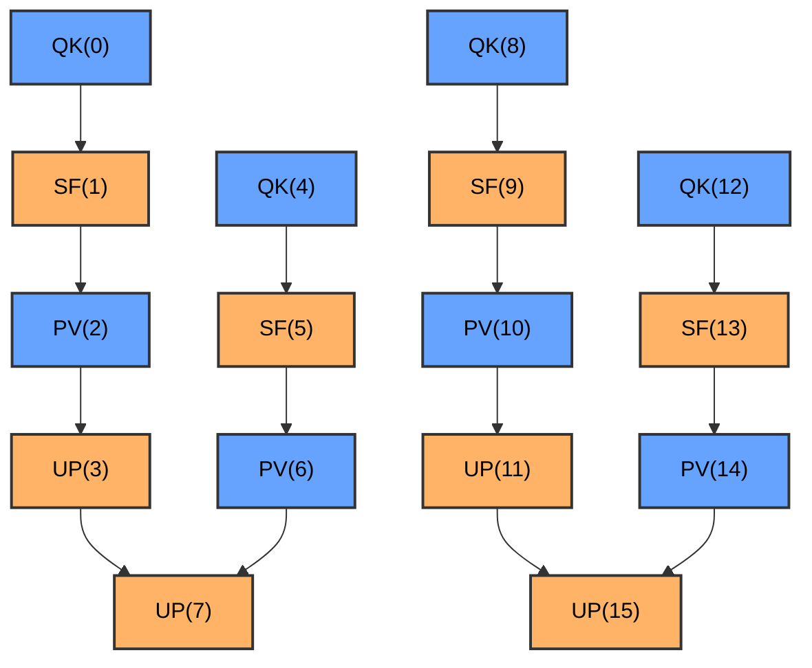

# Swimlane 性能分析工具

本目录包含 PTO Runtime 的性能分析工具。

## 工具列表

- **[swimlane_converter.py](#swimlane_converterpy)** - 转换为 Chrome Trace Event 可视化格式
- **[sched_overhead_analysis.py](#sched_overhead_analysispy)** - Scheduler 开销分析（Tail OH 分解）
- **[perf_to_mermaid.py](#perf_to_mermaidpy)** - 转换为 Mermaid 依赖图

---

## swimlane_converter.py

将性能分析数据 JSON 文件转换为 Chrome Trace Event 格式，以便在 Perfetto 中可视化。

### 功能概述

`swimlane_converter.py` 将 PTO Runtime 的性能分析数据（`perf_swimlane_*.json`）转换为可在 Perfetto 跟踪查看器（https://ui.perfetto.dev/）中可视化的格式。同时提供按函数分组的任务执行统计分析，并在解析到 device log 时输出 scheduler overhead deep-dive 报告。

### 基本用法

```bash
# 自动检测 outputs/ 目录中最新的性能分析文件
python3 tools/swimlane_converter.py

# 指定输入文件
python3 tools/swimlane_converter.py outputs/perf_swimlane_20260210_143526.json

# 指定输出文件
python3 tools/swimlane_converter.py outputs/perf_swimlane_20260210_143526.json -o custom_output.json

# 从 kernel_config.py 加载函数名映射
python3 tools/swimlane_converter.py outputs/perf_swimlane_20260210_143526.json \
    -k examples/host_build_graph/paged_attention/kernels/kernel_config.py

# 使用指定 device id 自动选择 device log（device-<id>）
python3 tools/swimlane_converter.py outputs/perf_swimlane_20260210_143526.json -d 0

# 详细模式（用于调试）
python3 tools/swimlane_converter.py outputs/perf_swimlane_20260210_143526.json -v
```

### 命令行选项

| 选项 | 简写 | 说明 |
|------|------|------|
| `input` | | 输入 JSON 文件（perf_swimlane_*.json）。如果省略，使用 outputs/ 中最新的文件 |
| `--output` | `-o` | 输出 JSON 文件（默认：outputs/merged_swimlane_<timestamp>.json） |
| `--kernel-config` | `-k` | kernel_config.py 文件路径，用于函数名映射 |
| `--device-log` | | 设备日志文件/目录/glob 覆盖输入（优先级最高） |
| `--device-id` | `-d` | 指定 device id，从 `device-<id>` 目录自动选择日志 |
| `--verbose` | `-v` | 启用详细输出 |

### device log 选择优先级

`swimlane_converter.py` 和 `sched_overhead_analysis.py` 使用一致的解析规则：

1. `--device-log`（文件/目录/glob）显式覆盖
2. `-d/--device-id` 对应 `device-<id>` 目录
3. 自动扫描 `device-*`，选择最接近 perf 时间戳的 `.log`

log root 解析顺序：
- `$ASCEND_WORK_PATH/log/debug/`
- `~/ascend/log/debug/`（fallback）

### 输出内容

工具生成三类输出：

#### 1. Perfetto JSON 文件

可在 Perfetto 中可视化的 Chrome Trace Event 格式 JSON 文件：
- 文件位置：`outputs/merged_swimlane_<timestamp>.json`
- 打开 https://ui.perfetto.dev/ 并拖入文件即可可视化

#### 2. 任务统计信息

按函数分组的统计摘要（打印到控制台），包含 Exec/Latency 对比和调度开销分析：

- **Exec**：AICore 上的 kernel 执行时间（end_time - start_time）
- **Latency**：AICPU 视角的端到端延迟（finish_time - dispatch_time，包含 head OH + Exec + tail OH）
- **Head/Tail OH**：调度头部/尾部开销
- **Exec_%**：Exec / Latency 百分比（kernel 利用率）

解析到 device log 时，还会输出 Sched CPU（AICPU scheduler 线程实际 CPU 时间 per task）和 Exec/Sched_CPU 比率。

#### 3. Scheduler overhead deep-dive（自动）

当 device log 成功解析后，`swimlane_converter.py` 会直接调用 `sched_overhead_analysis` 的分析逻辑，并在同一次运行中输出：

- Part 1: Per-task time breakdown
- Part 2: AICPU scheduler loop breakdown
- Part 3: Tail OH distribution & cause analysis

### 与 run_example.py 集成

启用性能分析运行测试时，转换器会自动调用：

```bash
# 运行测试并启用性能分析 - 测试通过后自动生成 merged_swimlane.json
python examples/scripts/run_example.py \
    -k examples/host_build_graph/vector_example/kernels \
    -g examples/host_build_graph/vector_example/golden.py \
    --enable-profiling
```

测试通过后，工具将：
1. 自动检测 outputs/ 中最新的 `perf_swimlane_*.json`
2. 从 `-k` 指定的 kernel_config.py 加载函数名
3. 把运行时有效 device id（`-d`）透传给 `swimlane_converter.py`
4. 自动解析 device log 并输出选择策略
5. 生成 `merged_swimlane_*.json` 用于可视化
6. 将任务统计与 scheduler overhead deep-dive 报告打印到控制台

---

## sched_overhead_analysis.py

分析 AICPU scheduler 的调度开销，定量分解 Tail OH（任务完成到 scheduler 确认之间的延迟）的来源。

### 功能概述

`sched_overhead_analysis.py` 从两个数据源进行分析：
1. **Perf profiling 数据**（`perf_swimlane_*.json`）：提取每个 task 的 Exec / Head OH / Tail OH 时间分解
2. **设备日志**（device log）：解析 AICPU scheduler 线程的循环分解（scan / complete / dispatch / yield）、锁竞争和 fanout 统计

### 基本用法

```bash
# 自动选取最新的 perf 数据和设备日志
python3 tools/sched_overhead_analysis.py

# 指定 device id 自动选取 device-<id> 日志
python3 tools/sched_overhead_analysis.py --perf-json outputs/perf_swimlane_20260210_143526.json -d 0

# 指定文件
python3 tools/sched_overhead_analysis.py \
    --perf-json outputs/perf_swimlane_20260210_143526.json \
    --device-log ~/ascend/log/debug/device-0/device-*.log
```

### 命令行选项

| 选项 | 说明 |
|------|------|
| `--perf-json` | perf_swimlane_*.json 文件路径。省略时自动选取 outputs/ 中最新的文件 |
| `--device-log` | 设备日志文件/目录/glob 覆盖输入（优先级最高） |
| `-d, --device-id` | 指定 device id，从 `device-<id>` 自动选取日志 |

### 输出内容

分三部分输出：

- **Part 1：Per-task time breakdown** — Exec / Head OH / Tail OH 各占 Latency 的百分比
- **Part 2：AICPU scheduler loop breakdown** — 各 scheduler 线程的循环统计、各阶段（scan / complete / dispatch / yield）耗时占比、锁竞争和 fanout 统计
- **Part 3：Tail OH distribution & cause analysis** — Tail OH 分位数分布（P10~P99）、scheduler CPU time per task 分解（按占比降序）、Tail OH 与 scheduler loop 迭代的关联分析

---

## perf_to_mermaid.py

将性能分析数据转换为 Mermaid 流程图格式，可视化任务依赖关系。

### 功能概述

`perf_to_mermaid.py` 将 PTO Runtime 的性能分析数据（`perf_swimlane_*.json`）转换为 Mermaid 流程图格式。生成的 Markdown 文件可以：
- 在 GitHub/GitLab 中直接渲染
- 在 https://mermaid.live/ 中查看
- 在支持 Mermaid 的编辑器中查看（如 VS Code + Mermaid 插件）

### 基本用法

```bash
# 自动检测 outputs/ 目录中最新的性能分析文件
python3 tools/perf_to_mermaid.py

# 指定输入文件
python3 tools/perf_to_mermaid.py outputs/perf_swimlane_20260210_143526.json

# 指定输出文件
python3 tools/perf_to_mermaid.py outputs/perf_swimlane_20260210_143526.json -o diagram.md

# 从 kernel_config.py 加载函数名映射
python3 tools/perf_to_mermaid.py outputs/perf_swimlane_20260210_143526.json \
    -k examples/host_build_graph/paged_attention/kernels/kernel_config.py

# 使用紧凑样式（仅显示任务ID和函数名）
python3 tools/perf_to_mermaid.py outputs/perf_swimlane_20260210_143526.json --style compact

# 详细模式
python3 tools/perf_to_mermaid.py outputs/perf_swimlane_20260210_143526.json -v
```

### 命令行选项

| 选项 | 简写 | 说明 |
|------|------|------|
| `input` | | 输入 JSON 文件（perf_swimlane_*.json）。如果省略，使用 outputs/ 中最新的文件 |
| `--output` | `-o` | 输出 Markdown 文件（默认：outputs/mermaid_diagram_<timestamp>.md） |
| `--kernel-config` | `-k` | kernel_config.py 文件路径，用于函数名映射 |
| `--style` | | 节点样式：`detailed`（详细，包含核心和时间）或 `compact`（紧凑，仅函数名）|
| `--verbose` | `-v` | 启用详细输出 |

### 输出内容

生成包含 Mermaid 流程图的 Markdown 文件：

#### Detailed 样式（默认）




## 共同配置

### 输入文件格式

两个工具都接受相同的输入格式 - PTO Runtime 生成的 `perf_swimlane_*.json` 文件：

```json
{
  "version": 1,
  "tasks": [
    {
      "task_id": 0,
      "func_id": 0,
      "core_id": 0,
      "core_type": "aic",
      "start_time_us": 100.0,
      "end_time_us": 250.5,
      "duration_us": 150.5,
      "kernel_ready_time_us": 95.0,
      "fanout": [1, 2],
      "fanout_count": 2
    }
  ]
}
```

### Kernel Config 格式

要在输出中显示有意义的函数名，需要提供 `kernel_config.py` 文件：

```python
KERNELS = [
    {
        "func_id": 0,
        "name": "QK",
        # ... 其他字段
    },
    {
        "func_id": 1,
        "name": "SF",
        # ... 其他字段
    },
]
```

工具从 `KERNELS` 列表中提取 `func_id` 到 `name` 的映射。

---

## 工具选择建议

### 使用 swimlane_converter.py 当你需要：
- ✅ 查看详细的时间线执行视图
- ✅ 分析任务在不同核心上的调度情况
- ✅ 查看精确的执行时间和时间间隔
- ✅ 获取任务执行的统计信息
- ✅ 专业的性能分析和优化

### 使用 perf_to_mermaid.py 当你需要：
- ✅ 快速查看任务依赖关系
- ✅ 在文档中嵌入依赖图
- ✅ 在代码审查中分享依赖结构
- ✅ 不需要时间线细节，只关注拓扑结构
- ✅ 在 GitHub/GitLab 中直接查看

### 推荐工作流

```bash
# 1. 运行测试获取性能数据
python examples/scripts/run_example.py -k ./kernels -g ./golden.py --enable-profiling

# 2. 生成 Perfetto 可视化（自动）
# → outputs/merged_swimlane_*.json

# 3. 生成 Mermaid 依赖图
python3 tools/perf_to_mermaid.py -k ./kernels/kernel_config.py

# 4. 分析结果
# - 详细性能分析：Perfetto (https://ui.perfetto.dev/)
# - 依赖关系概览：Mermaid 图（GitHub/编辑器）
# - 统计摘要：控制台输出
```

---

## 故障排查

### 错误：找不到 perf_swimlane_*.json 文件
- 确保使用 `--enable-profiling` 标志运行了测试
- 检查 outputs/ 目录是否存在并包含性能分析数据

### 警告：Kernel entry missing 'func_id' or 'name'
- 检查 kernel_config.py 文件格式
- 确保所有 KERNELS 条目都有 'func_id' 和 'name' 字段

### 错误：Unsupported version
- 工具仅支持版本 1 的性能分析数据格式
- 使用最新的 runtime 重新生成性能分析数据

### 错误：Perf JSON missing required fields for scheduler overhead analysis
- 该错误表示输入的 `perf_swimlane_*.json` 缺少 deep-dive 分析需要的字段（通常是 `dispatch_time_us` / `finish_time_us`）
- `swimlane_converter.py` 的基础转换可继续成功，但 deep-dive 会跳过或失败
- 处理路径：
  1. 使用 `--enable-profiling` 重新跑一次，生成新的 `outputs/perf_swimlane_*.json`
  2. 重新执行 `swimlane_converter.py` 或 `sched_overhead_analysis.py`
  3. 检查 JSON 中每个 task 是否包含 `dispatch_time_us` 和 `finish_time_us`

### Mermaid 图在 GitHub 上不显示
- 确保文件是 `.md` 扩展名
- 检查 Mermaid 语法是否正确
- GitHub 有时需要刷新才能渲染 Mermaid 图

---

## 输出文件说明

| 文件 | 工具 | 用途 | 格式 |
|------|------|------|------|
| `perf_swimlane_*.json` | Runtime | 原始性能分析数据 | JSON |
| `merged_swimlane_*.json` | swimlane_converter.py | Perfetto 可视化 | Chrome Trace Event JSON |
| `mermaid_diagram_*.md` | perf_to_mermaid.py | 依赖关系图 | Markdown + Mermaid |

---

## 相关资源

- [PTO Runtime 文档](../docs/)
- [示例测试用例](../examples/)
- [Perfetto Trace Viewer](https://ui.perfetto.dev/)
- [Mermaid Live Editor](https://mermaid.live/)
- [Mermaid 文档](https://mermaid.js.org/)
